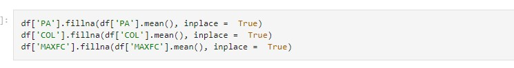
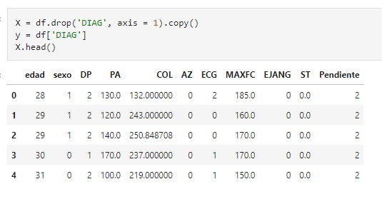

# Heart Disease Prediction Model
Model that will predict whether or not a patient has heart disease.

For this purpose, we have the following data set.
.

Steps for training the model.
### 1. First we import the dataset with pandas.

### 2.  Data preparation.
Data cleaning, we replace categorical data with mode, numerical data with mean. Then data splitting for training and testing.

Delete the column 'HR' because have 80% the data is null.

Replacing the null data with the most frequent value to the categorical variables.

Replacing the null data with the average value to the numerical variables.

As can be seen in the following output we no longer have null data.

We separate the variables into outputs (the DIAG variable), and inputs (the rest of the variables).

We standardized the numerical input variables, and coded the categorical input variables. We code the categorical input variables, Standardize the numerical input variables.

#### We split the data for training and testing.

### 3. Train the Logistic regression model
Trained models take unseen data and give an estimate if the patient does or does not have heart disease.

Confusion_matrix

With an accuracy of 0.84878048487804878 training and with an accuracy of 0.8314606741573034 testing with unknown data.

### 4. Evaluate the model.
Check the accuracy of the predictions with the unknown data

